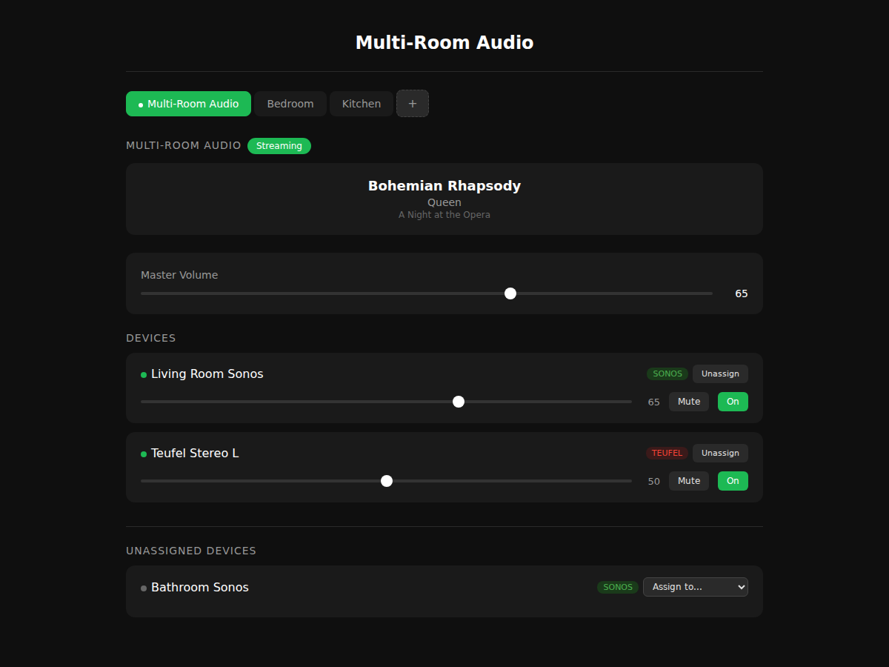
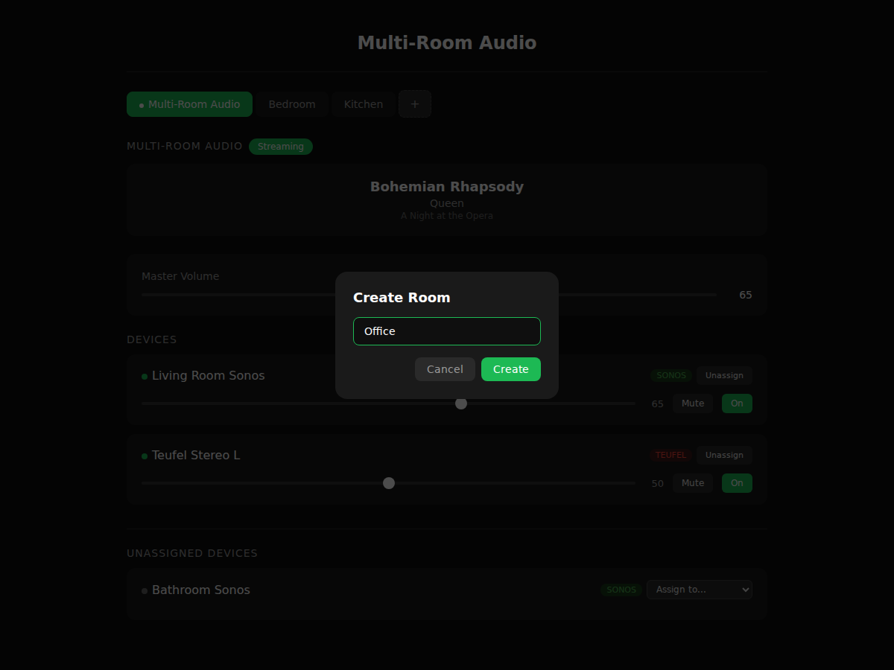
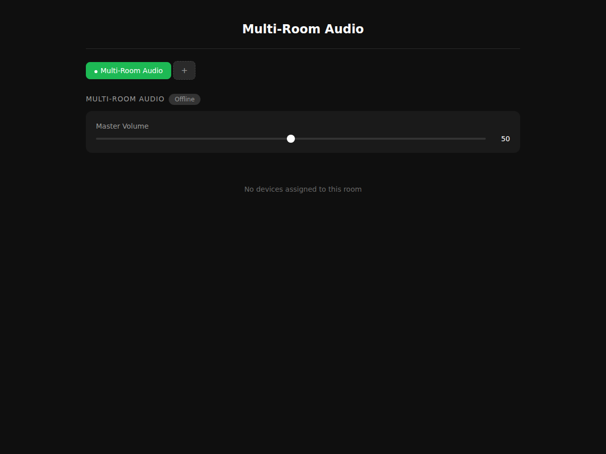

# Multi-Room Audio Multiplexer

A multi-room audio distribution system written in Rust. Receives audio via AirPlay (using shairport-sync) and broadcasts it to Sonos, Teufel/DLNA, and AirPlay speakers across your network. Each room gets its own independent AirPlay receiver, audio pipeline, and device group.

## Screenshots

### Dashboard with Rooms and Devices


### Room Creation


### Idle State


## Architecture

```
Room "Living Room":
  AirPlay Source -> shairport-sync:5100 -> StreamManager_1 -> [Sonos, Teufel]

Room "Bedroom":
  AirPlay Source -> shairport-sync:5101 -> StreamManager_2 -> [AirPlay Speaker]

Unassigned Pool:
  [Discovered devices not yet assigned to any room]
```

Each room is an independent audio pipeline with its own:
- **AirPlay receiver** (shairport-sync instance on a unique port)
- **Audio stream** (PCM broadcast channel + HTTP WAV endpoint)
- **Device group** (speakers assigned to this room)
- **Metadata** (now-playing info per room)

Devices are auto-discovered via SSDP (Sonos, Teufel/DLNA) and mDNS (AirPlay), then assigned to rooms through the UI or API.

## Features

- **Virtual Rooms** -- Create rooms, assign speakers, play different music in each room
- **Multi-protocol** -- Sonos (UPnP), Teufel/DLNA (UPnP), AirPlay devices
- **Auto-discovery** -- SSDP + mDNS device discovery with 30s polling
- **Real-time UI** -- Dark-themed web dashboard with SSE live updates
- **Per-device control** -- Volume, mute, enable/disable per device per room
- **Master volume** -- Per-room master volume slider
- **SQLite persistence** -- Room configs and device assignments survive restarts
- **Legacy API** -- Backward-compatible flat device API for existing integrations
- **WAV streaming** -- Per-room HTTP audio stream endpoints

## Setup

### Prerequisites

- **Rust** (1.70+)
- **shairport-sync** -- AirPlay receiver ([install guide](https://github.com/mikebrady/shairport-sync))

### Build

```bash
cargo build --release
```

### Run

```bash
./target/release/audio-multiplexer
```

The dashboard is available at `http://localhost:5000/`.

### Environment Variables

| Variable | Default | Description |
|----------|---------|-------------|
| `RECEIVER_NAME` | `Multi-Room Audio` | Base AirPlay receiver name |
| `HTTP_PORT` | `5000` | HTTP server port |
| `DB_PATH` | `audio_multiplexer.db` | SQLite database path |
| `SHAIRPORT_PATH` | `shairport-sync` | Path to shairport-sync binary |
| `SHAIRPORT_BASE_PORT` | `5100` | Base port for room shairport instances |
| `LOCAL_IP` | auto-detected | Local IP for audio stream URLs |
| `SAMPLE_RATE` | `44100` | Audio sample rate |
| `BIT_DEPTH` | `16` | Audio bit depth |
| `CHANNELS` | `2` | Audio channel count |

## API

### System

| Method | Path | Description |
|--------|------|-------------|
| `GET` | `/api/system/status` | Full system status (all rooms + unassigned devices) |

### Rooms

| Method | Path | Description |
|--------|------|-------------|
| `GET` | `/api/rooms` | List all rooms |
| `POST` | `/api/rooms` | Create room `{ "name": "..." }` |
| `GET` | `/api/rooms/{id}` | Single room status |
| `PUT` | `/api/rooms/{id}` | Rename room `{ "name": "..." }` |
| `DELETE` | `/api/rooms/{id}` | Delete room (moves devices to unassigned) |

### Room Devices

| Method | Path | Description |
|--------|------|-------------|
| `POST` | `/api/rooms/{id}/devices` | Assign device `{ "deviceId": "..." }` |
| `DELETE` | `/api/rooms/{id}/devices/{deviceId}` | Unassign device |
| `POST` | `/api/rooms/{id}/devices/{deviceId}/volume` | Set volume `{ "volume": 0-100 }` |
| `POST` | `/api/rooms/{id}/devices/{deviceId}/mute` | Set mute `{ "muted": bool }` |
| `POST` | `/api/rooms/{id}/devices/{deviceId}/enable` | Enable/disable `{ "enabled": bool }` |
| `POST` | `/api/rooms/{id}/master-volume` | Room master volume `{ "volume": 0-100 }` |

### Unassigned Devices

| Method | Path | Description |
|--------|------|-------------|
| `GET` | `/api/unassigned-devices` | List unassigned devices |

### Audio Streams

| Method | Path | Description |
|--------|------|-------------|
| `GET` | `/audio/stream` | Default room WAV stream |
| `GET` | `/audio/stream/{roomId}` | Per-room WAV stream |

### SSE Events

| Method | Path | Description |
|--------|------|-------------|
| `GET` | `/api/events` | Server-sent events (systemStatus + legacy status) |

### Legacy (backward-compatible, operates on default room)

| Method | Path | Description |
|--------|------|-------------|
| `GET` | `/api/status` | Default room status |
| `GET` | `/api/devices` | Default room devices |
| `POST` | `/api/devices/{id}/volume` | Set device volume |
| `POST` | `/api/devices/{id}/mute` | Set device mute |
| `POST` | `/api/devices/{id}/enable` | Enable/disable device |
| `POST` | `/api/master-volume` | Default room master volume |

## Tech Stack

- **Rust** + **Tokio** async runtime
- **Axum** web framework
- **SQLite** (rusqlite) for persistence
- **shairport-sync** for AirPlay reception
- **UPnP/SOAP** for Sonos and Teufel/DLNA control
- **mDNS** (mdns-sd) + **SSDP** for device discovery
- **SSE** for real-time UI updates

## License

MIT
